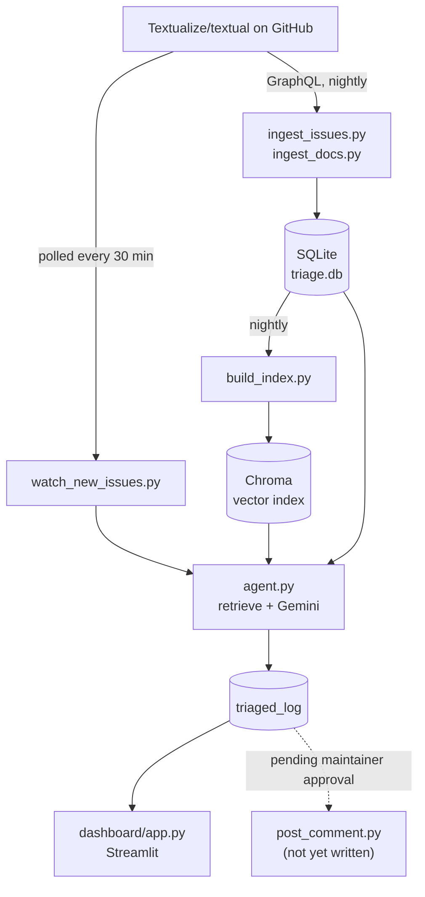

# OSS Triage Copilot

An AI system that watches new issues on [Textualize/textual](https://github.com/Textualize/textual)
and drafts a triage suggestion for each one: labels, a duplicate check against
past issues, a priority call, and a first-response draft grounded in the
project's actual docs. Runs entirely on free infrastructure, end to end.

**Currently in shadow mode.** It reads issues and reasons about them, but
posts nothing to GitHub. That's deliberate — see [Known limitations](#known-limitations)
and the [roadmap](#roadmap) for what changes once a maintainer agrees to it.

## Why this exists

This started as a way to get real, hands-on practice with the parts of the
job that don't show up in a tutorial: an API that caps pagination at 1,000
results with no warning, a rate limit that's actually two different limits
wearing the same error code, a workflow permission that's read-only by
default, a retry loop that quietly re-raised the wrong exception. Every one
of those is a real bug this project hit and fixed — see the commit history,
not just this file, for the actual debugging trail.

The shape of the work is deliberately the same shape as forward-deployed
engineering: an ambiguous problem ("help maintainers handle their issue
backlog"), turned into a concrete spec, built as a working prototype,
deployed against a real live data source, and iterated on when reality
disagreed with the plan.

## Architecture



## Real results so far

Numbers from the live dashboard, not projections:

| | |
|---|---|
| Issues in the corpus | 2,434 (232 open, 2,202 closed) |
| Docs indexed | 294 markdown files |
| Issues triaged (shadow mode) | 20+ and growing every 30 minutes |
| Duplicate flag rate | ~5% |
| Cost | $0 |

Three specific test cases, each chosen because it was informative, not
because it made the system look good:

- **[#6699](https://github.com/Textualize/textual/issues/6699) — correct rejection.** Five topically-close RichLog/scrollbar issues
  retrieved as candidates; the agent correctly declined to flag any of them
  as a duplicate of a genuinely distinct bug, instead of false-flagging on
  surface similarity.
- **[#5225](https://github.com/Textualize/textual/issues/5225) — a real miss, and what it taught the design.** Manually confirmed
  as a duplicate of #4955. Retrieval correctly surfaced #4955 at rank #2 of
  5, but the LLM's own judgment still said "no duplicate" — even after
  widening the context window. The likely cause: the connection relied on
  maintainer knowledge that isn't written in either issue's text at all,
  which no amount of retrieval or prompt tuning can recover. This is why
  `format_decision()` always shows the raw retrieved candidates in a
  collapsible section regardless of what the LLM concluded — a safety net
  for exactly this failure mode.
- **[#5433](https://github.com/Textualize/textual/issues/5433) — confirmed true positive.** The agent identified it as a
  duplicate of #4900 with `high` confidence and reasoning citing the exact
  mechanism (`TEXTUAL_ANIMATION` env var / repeated clearing causing a
  `KeyError`). GitHub's own closing reference confirmed: "marked as a
  duplicate of #4900." Confirmed, not just plausible-sounding.

## Project structure

```
oss-triage-copilot/
├── src/
│   ├── ingest_issues.py    # GraphQL pull, cursor-paginated, resumable, rate-limit-aware
│   ├── ingest_docs.py      # markdown docs corpus via GitHub's tree + raw content APIs
│   ├── build_index.py      # chunks + embeds docs and issues into Chroma (local, no API)
│   ├── query_index.py      # manual retrieval testing
│   ├── agent.py            # run_triage(): retrieval + Gemini structured output
│   ├── watch_new_issues.py # polls for new issues, triages, logs to triaged_log
│   └── inspect_db.py       # quick counts/samples, no sqlite3 CLI needed
├── dashboard/
│   └── app.py               # Streamlit: volume trends, triage activity, browsable decisions
├── .github/workflows/
│   ├── nightly-ingest.yml   # refreshes issues + docs + index every night
│   └── triage-watch.yml     # polls and triages every 30 minutes
├── data/
│   ├── triage.db             # committed -- source of truth
│   └── chroma/                # gitignored -- derived, rebuilt from triage.db
├── requirements.txt
└── .env.example
```

## Setup

```bash
python3 -m venv .venv
source .venv/bin/activate       # Windows: .venv\Scripts\activate
pip install -r requirements.txt
cp .env.example .env
```

Two keys needed in `.env`, both free:

- **`GITHUB_TOKEN`** — fine-grained, "Public Repositories (read-only)" scope
  is enough: https://github.com/settings/tokens?type=beta. Required for
  `ingest_issues.py`, since it uses GraphQL, which has no meaningful
  unauthenticated quota.
- **`GEMINI_API_KEY`** — free tier: https://aistudio.google.com/app/apikey.
  Required for `agent.py` and `watch_new_issues.py`.

Both load automatically via `python-dotenv` — no shell-specific export
command needed, works identically on Windows, Mac, and Linux.

## Running it end to end

```bash
# 1. Pull issues (GraphQL, resumable -- rerunning after an interruption
#    continues from a checkpoint instead of starting over)
python src/ingest_issues.py --repo Textualize/textual --state all

# 2. Pull docs
python src/ingest_docs.py --repo Textualize/textual --docs-path docs

# 3. Build the RAG index (first run downloads a small local embedding
#    model, ~80MB, then works offline)
python src/build_index.py

# 4. Sanity-check retrieval before trusting the agent on top of it
python src/query_index.py "app crashes on startup with a KeyError"

# 5. Run the agent against a real issue already in your DB (leave-one-out --
#    the issue is excluded from its own retrieval results)
python src/agent.py --number 6699

# 6. Or a hypothetical new issue that isn't in the DB at all
python src/agent.py --title "App crashes on startup" --body "KeyError in CSS parser"

# 7. Poll for and triage whatever's actually new right now
python src/watch_new_issues.py --repo Textualize/textual

# 8. See it all together
streamlit run dashboard/app.py
```

Everything is idempotent — rerunning any step just updates what changed
(`ON CONFLICT ... DO UPDATE`), which is exactly what the scheduled workflows
do automatically.

## Automation

Two GitHub Actions workflows, both free (unlimited minutes on public repos):

**`nightly-ingest.yml`** — refreshes issues and docs every night, commits
`triage.db` back to the repo. Uses the auto-provided `secrets.GITHUB_TOKEN`;
needs `permissions: contents: write` set explicitly, since Actions tokens
default to read-only.

**`triage-watch.yml`** — polls every 30 minutes for new issues, triages
anything not already in `triaged_log`. Needs `GEMINI_API_KEY` added manually
as a repo secret (Settings → Secrets and variables → Actions), since that
one isn't auto-provided. Caches the Chroma index (keyed on `triage.db`'s
content hash) so it only rebuilds when the underlying data actually
changed — not on every 30-minute poll.

Both workflows handle failure gracefully rather than losing partial
progress: `ingest_issues.py` checkpoints its cursor so an interrupted pull
resumes instead of restarting, and `watch_new_issues.py` catches per-issue
failures (rate limits, transient server overload) without crashing the
whole run and losing already-completed triage results.

### Why polling, not a push trigger

GitHub's `on: issues: opened` only fires for activity in the repo
*containing the workflow file*. Since this project doesn't own or
administer `Textualize/textual`, there's no way to get a real-time trigger
when someone opens a new issue there — that requires a maintainer to wire
up a webhook pointing at something this project controls, which hasn't
happened (yet). Polling every 30 minutes, checked against a local
`triaged_log` to avoid reprocessing, is the honest workaround: less elegant
than a push trigger, but it works without needing anything from anyone.

## Rate limits, the hard way

Free tiers turned out to have three genuinely different failure modes, each
requiring different handling:

- **GitHub secondary rate limiting** — triggers on request *pattern*, not
  just volume; hits Actions runners harder than a personal machine, since
  they share heavily-used IP ranges. Fixed with exponential-ish backoff
  reading GitHub's own `Retry-After` header.
- **Gemini per-minute quota** — resets in under a minute; worth retrying,
  using the exact delay Google's error message provides.
- **Gemini per-day quota** — resets on a ~24h cycle; retrying within the
  same run is pure wasted time. Detected by parsing the `quotaId` in the
  error details and failing fast instead of burning through retries.

## Known limitations

**Duplicate detection can miss duplicates the LLM has no way to see.** See
the #5225 case above. Mitigation: the raw retrieved candidates are always
shown alongside the LLM's own call, not hidden whenever it says "none."

**No accuracy metrics yet.** "Response-time impact" and "label accuracy"
aren't in the dashboard, on purpose — neither is measurable without live
posting to compare against and a human-feedback loop confirming whether
suggested labels match what a maintainer would actually choose. Both are
real numbers, once step 7 gets there; showing invented ones now would be
worse than showing nothing.

**No posting capability exists yet.** `post_comment.py` hasn't been
written. This isn't a flag switched off — the code path doesn't exist,
so there's no way for this project to touch `Textualize/textual` even by
accident.

## Roadmap

1. ~~Scope the problem~~ — read real issues, find what's actually painful
2. ~~Data pipeline~~ — issues + docs into SQLite, refreshed nightly
3. ~~RAG layer~~ — docs + open/closed issues embedded into Chroma
4. ~~Triage agent~~ — retrieval + Gemini structured output, validated across
   reject / miss / confirm cases
5. ~~Shadow-mode watcher~~ — polls every 30 min, handles rate limits and
   server overload gracefully
6. ~~Dashboard~~ — real volume trends and triage activity, honest about
   what it doesn't measure yet
7. **Real feedback received** — the maintainer declined (a single 👎
   reaction, [discussion](https://github.com/Textualize/textual/discussions/6700)
   closed without further comment). Respected without pushback; the project
   continues running in shadow mode as a demonstration rather than pursuing
   live posting. This is a realistic outcome, not a failure of the
   engineering — many OSS maintainers are broadly cautious about AI-driven
   bot activity on their issue tracker right now, independent of a specific
   tool's quality. `post_comment.py` remains unwritten by design.

## Cost

$0, indefinitely, not just during a trial: GitHub API (free), GitHub
Actions (free, unlimited minutes on public repos), SQLite (free, no
server), Chroma with a local ONNX embedding model (free, self-hosted, no
API calls), Gemini free tier (free, rate-limited rather than metered), and
Streamlit Community Cloud (free hosting). No credit card anywhere in this
stack.

## Tech stack

Python · SQLite · Chroma (local embeddings, no API) · Google Gemini
(`gemini-3.6-flash`, structured output via Pydantic schema) · GitHub
GraphQL + REST APIs · GitHub Actions · Streamlit
